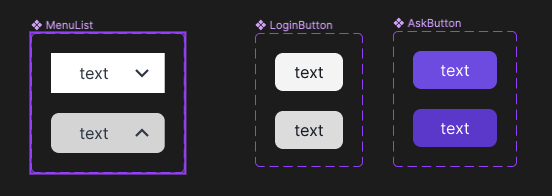

# 1주차 React 과제

## 피그마 시안

- [Figma 링크](https://www.figma.com/file/rHbGRhza07Y58KEgZz8eDz/Untitled?type=design&node-id=0%3A1&mode=design&t=aJJp6CVL74sgIPye-1)

- 3종류의 버튼을 만들고, hover한 경우를 variant로 주었습니다.

## 구현 화면

## 파일 구조

    src
    ├── App.css
    ├── App.jsx
    ├── layout
    │   ├── Header
    │   │    ├── parts
    │   │    │    ├── MainMenu.jsx
    │   │    │    ├── SubButtons.jsx
    │   │    │    ├── Heading.jsx
    │   │    │    ├── MenuLists.jsx
    │   │    │    ├── MenuList.jsx
    │   │    │    └── Button.jsx
    │   │    ├── Header.css
    │   │    └── Header.jsx
    │   └──  RootLayout.jsx
    ├── index.css
    └── main.jsx

## 참고할 부분

## Header.jsx

## H

#### randomDirection.jsx

## 회고

컴포넌트를 분리하는 과정에서, 컴포넌트 작명에 굉장히 고통을 받았다. 그 고민에 비해 컴포넌트명을 잘 작성하진 않는데, 연습이 필요한 부분이 필요하다.

또한, 이렇게까지 분리를 하는게 맞는 것일까 하는 고민도 공존했는데 이 또한,, 많이 만들어보고 설계해봐야할 부분이다.
