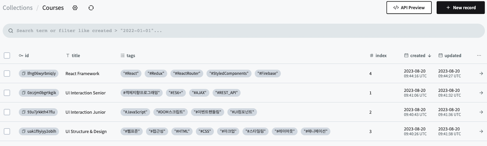
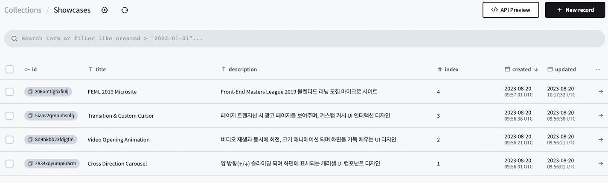
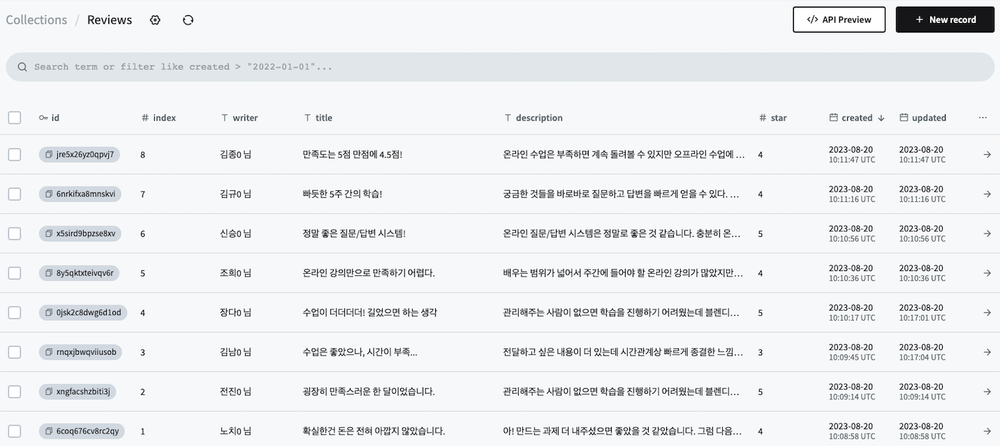

# 2주차 React 과제 - 랜딩 페이지 구현

[이듬 블렌디드 러닝](https://euid.dev/#/)의 메인 페이지를 구현해보고자 했습니다.

## 결과(구현화면) - 추후 배포 예정


### 포켓 베이스 DB 구성

1. Courses
   
2. ShowCases
   
3. Reviews
   

## 파일 구조

src

```js
src
├── assets
├── components // 하위 구조 하단 작성
├── layout
│    ├── FooterBar.jsx
│    ├── HeaderBar.jsx
│    └── RootLayout.jsx
├── styles
│    └── tailwind.css
├── App.css
├── App.jsx
└── main.jsx
```

components

```js
components
├── Common
│    ├── Spinner.jsx
│    ├── SubTitleWrapper.jsx
│    └── TitleWrapper.jsx
├── Footer
│    ├── FooterAbout.jsx
│    ├── FooterCopyright.jsx
│    ├── FooterIllust.jsx
│    └── FooterInfo.jsx
├── Header
│    ├── GlobalNavigation.jsx
│    └── HeaderHeading.jsx
└── Home
     ├── HomeWrapper.jsx
     ├── HomeHeading.jsx
     ├── HomeContents.jsx
     └── Contents
          ├── OpeningDay.jsx
          ├── CourseCategory.jsx
          ├── CourseItems.jsx
          ├── LectureHall.jsx
          ├── ShowCase.jsx
          ├── ShowItems.jsx
          ├── Review.jsx
          └── ReviewItems.jsx

```

## 회고

- 페이지를 여러 개를 만들어 라우팅을 시도해보고자 했으나,, 단일 페이지조차도 완벽하게 하지 못했다.
- CSS 애니메이션을 보고 시도해보고 싶었는데, 시간적인 여유를 충분히 가지지 못했다.
- 카카오맵 API와 react-multi-carousel을 충분히 익히지 못하고 사용해서 아쉬움이 남는다.
  (특히, multi-carousel은 시간상 원본을 좀 참고했었다..)
- CSS에서 디테일적인 아쉬움이 좀 많이 남는다.
